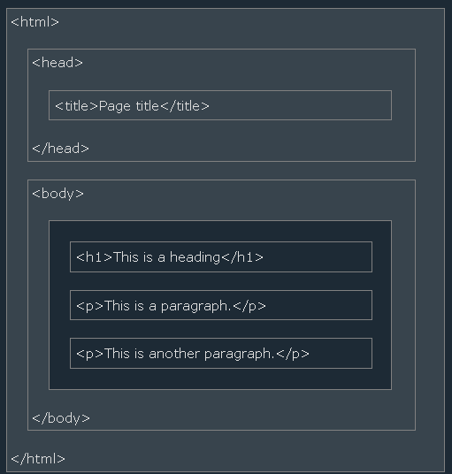

# 1. HTML INTRODUCTION

## What is HTML?

* It stands for Hyper Text Markup Language.
* It is a standard language for creating web pages.
* it describes the structure of the web page and consists of a series of elements.


> An example of HTML boilerplate:

```
<!DOCTYPE html>
<html>
<head>
<title>Page Title</title>
</head>
<body>

<h1>My First Heading</h1>
<p>My first paragraph.</p>

</body>
</html>
```

 Elements in the boiler plate:
 `<!DOCTYPE html>` : defines that this document is an HTML5 document.
 `<html>` : it is the root element of an HTML page.
 `<head>` : contains meta information about the HTML page.
 `<title>` : specifies a title for the HTML page.
 `<body>` : defines the document's body, and is a container for all the visible contents, such as headings, etc.
 `<h1>` : defines a large heading.
 `<p>` : defines a paragraph.

## HTML ELEMENTS

An HTML element is defined by a start tag, some content, and an end tag, it is a document component.

```
<Tagname> Content </Tagname>
```

| Start tag | Element content     | End tag  |
|-----------|---------------------|----------|
| `<h1>`      | My First Heading    | `</h1>`    |
| `<p>`       | My first paragraph. | `</p>`     |
| `<br>`      | none                | none     |


Some HTML elements have no content (like the <br> element). These elements are called empty elements. Empty elements do not have an end tag.



only the content within the **`<body>`** tag will be displayed in a browser and content inside the **`<title>`** tag will be shown in the webpage's title bar.